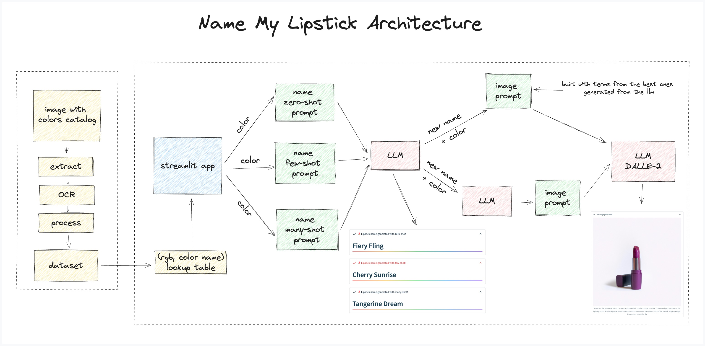

# Name My Lipstick

This my 1st project for the [KaggleX 2023 cohort 3](https://www.kagglex.org/) mentorship program.

The goal is to style transfer lipstick naming of a famous cosmetic brand based on the selected color using LLMs.

The dataset was built from the image below using image and ocr processing

More information can be found on this [💄 Name-My-Lipstick: Where AI Crafts Stunning Names and Fabulous Ad Images](https://medium.com/@tcvieira/name-my-lipstick-where-ai-crafts-stunning-names-and-fabulous-ad-images-699298fd2647)

Try on https://namemylipstick.streamlit.app/

## Features

- generate a lipstick name using zero-shot, few-shot and many-shot prompt approaches based on the select color using GPT-3.5;
- generate an ad image for the generated lipstick name using DALLE2.

## Architecture

## Work

- [x] extracted data from an image with the 2018 lipstick name and color of a famous cosmetic brand;
- [x] preprocessed the collected data to feed few-shot and many-shot prompts;
- [x] implemented a similirity color search based on CIELab to feed the few-shot prompt;
- [x] created a UI using Streamlit.
- [x] prompts
- [x] api calls
- [x] generate image from name + rgb color
